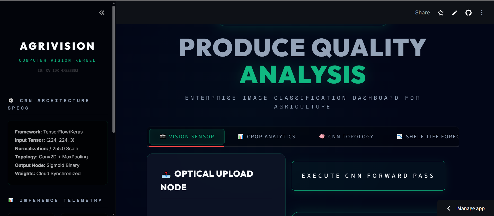
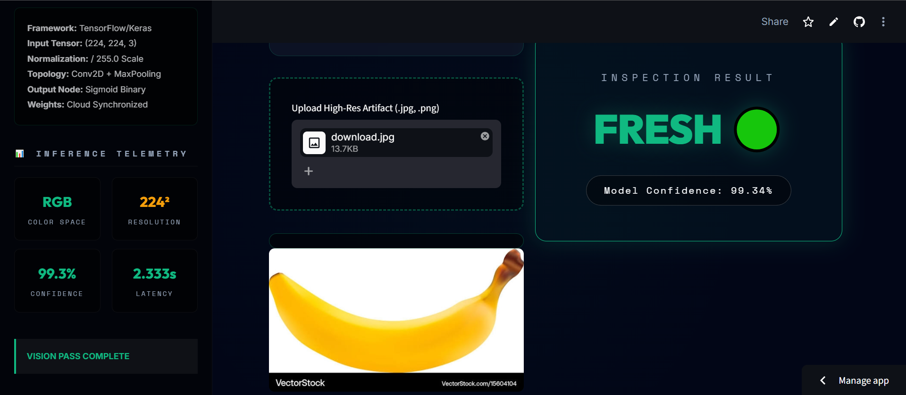
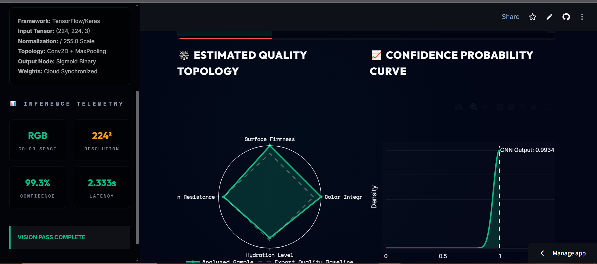

# 🍏 Fruit Classification (AgriVision Neural Engine)

Deployment Link :- https://fruit-clssification-bwzcu6tfaxybnkbvjbg62x.streamlit.app/

keras FIle link :- https://drive.google.com/file/d/1Nhy7VTxqkaIiMzBoeMbkc_X55mJhqnq4/view?usp=drive_link

#UI

📁 Dataset Overview

This project uses the Fruits Fresh and Rotten Classification Dataset, which is designed for image classification tasks in computer vision. The dataset contains images of various fruits categorized into fresh and rotten classes, enabling models to learn visual differences between good and spoiled produce.

The dataset is widely used for building and evaluating deep learning models such as CNNs for image classification problems.

📊 Dataset Summary

| Property     | Value                      |
| ------------ | -------------------------- |
| Dataset Type | Image Dataset              |
| Task Type    | Multi-Class Classification |
| Domain       | Computer Vision            |
| Data Format  | Images (JPG/PNG)           |
| Classes      | Fresh & Rotten Fruits      |

🍎 Classes in Dataset

The dataset includes multiple fruit categories, each divided into fresh and rotten classes, such as:

Fresh Apple / Rotten Apple
Fresh Banana / Rotten Banana
Fresh Orange / Rotten Orange
Fresh Mango / Rotten Mango
Fresh Strawberry / Rotten Strawberry

Each class contains labeled images used for training and evaluating classification models.

🧠 Dataset Structure

The dataset is typically organized into directories:

        dataset/

                │
                ├── train/
                │   ├── freshapples/
                │   ├── rottenapples/
                │   ├── freshbanana/
                │   ├── rottenbanana/
                │   └── ...
                │
                ├── validation/
                │   └── (same class structure)
                │
                └── test/
                    └── (same class structure)

🔑 Key Features
Labeled image dataset for supervised learning
Multiple fruit categories
Clear distinction between fresh and rotten states
Suitable for CNN-based image classification
Real-world applicability in agriculture and retail

🎯 Objective of the Dataset

The main objective is to:

Classify fruits as fresh or rotten
Train deep learning models to recognize visual patterns
Improve accuracy in automated quality inspection systems

## 📌 Project Overview
**AgriVision** is an enterprise-grade Computer Vision dashboard designed for automated produce quality assurance. Powered by a Deep Convolutional Neural Network (CNN), the system analyzes optical tensors (images) to classify fruits as either **Fresh** or **Rotten**. 

The current model weights are specifically trained to identify decay patterns in:
* 🍎 **Apples**
* 🍌 **Bananas**
* 🍊 **Oranges**

The platform features a monolithic, 6-tab OS environment complete with spatial extraction telemetry, 14-day shelf-life decay forecasting, and Monte Carlo batch variance simulations.

## 🚀 Enterprise Features
* **🧠 Deep Vision Architecture:** Powered by a TensorFlow/Keras CNN utilizing Conv2D filters, MaxPooling for spatial downsampling, and a Sigmoid binary output node.
* **🕸️ Quality Topology Analytics:** Dynamic Plotly radar charts to visualize estimated produce integrity (Color, Firmness, Hydration).
* **📉 Shelf-Life Simulator:** Models exponential biological decay for both ambient (22°C) and refrigerated (4°C) storage environments.
* **🎲 Batch Variance Engine:** Executes 1000-iteration Monte Carlo simulations to model quality distributions across large shipping crates.
* **💾 Secure Dossier Export:** Generates downloadable JSON and CSV artifacts containing the optical inspection telemetry.

## 📁 Repository Structure

📦 Fruit-Classification

      ┣ 📜 app.py                            # Main Streamlit UI (AgriVision Monolithic Build)
      ┣ 📜 fruits_classification_model.keras # Trained Keras CNN (Deep Learning Weights)
      ┣ 📜 Fruit_classification.ipynb        # Jupyter Notebook with Model Training/Augmentation Code
      ┣ 📜 requirements.txt                  # Python dependency lockfile
      ┗ 📜 README.md                         # System documentation

🛠️ Installation & Setup

1. Clone the repository

       git clone [https://github.com/akshitgajera1013/Fruit-Classification.git](https://github.com/akshitgajera1013/Fruit-Classification.git)

       cd Fruit-Classification

2. Create a Virtual Environment (Recommended)

       python -m venv venv
       source venv/bin/activate  # On Windows use: venv\Scripts\activate

3. Install Dependencies
   
       pip install -r requirements.txt

4. Execute the Vision Engine
   
       streamlit run app.py

⚙️ Model Pipeline Specifications

     Input Tensor: (224, 224, 3) — Standardized RGB Color Space.
     
     Normalization: Pixel values rescaled via / 255.0.
     
     Augmentation: Random horizontal flipping, rotation (20%), and zooming (20%) applied during training to prevent overfitting.
     
     Loss Function: Binary Crossentropy.
     
     Optimizer: Adam.
